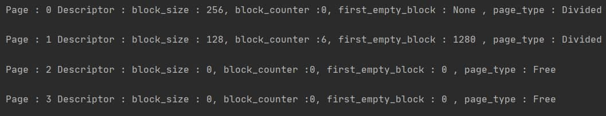
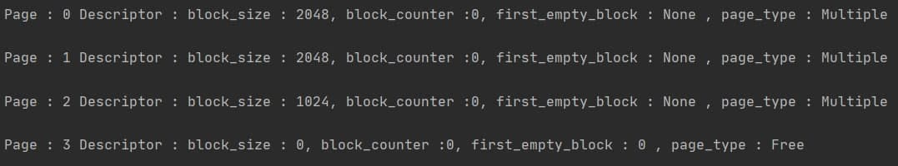
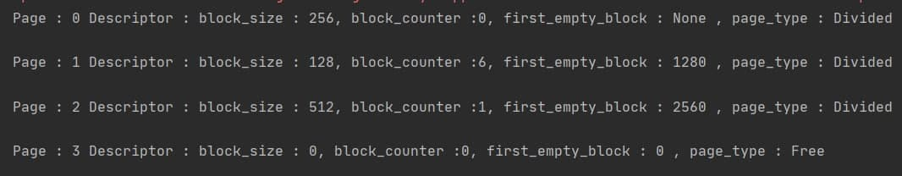
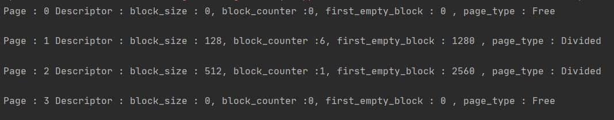
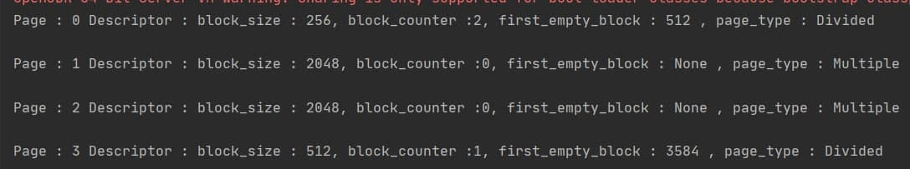
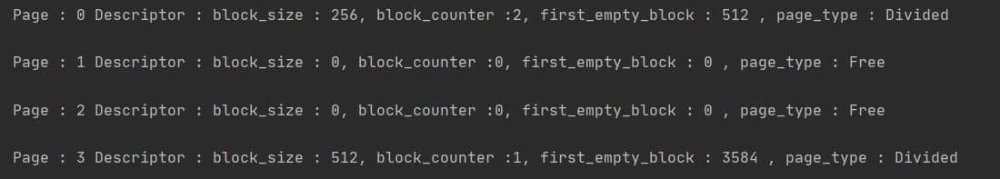
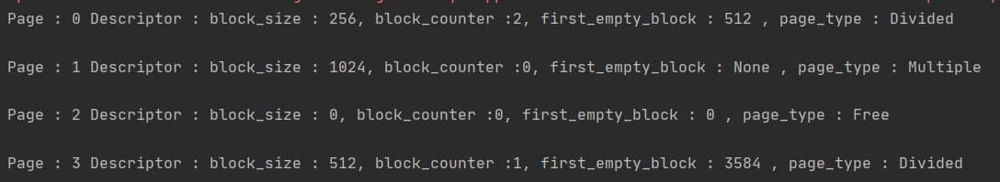

# Lab2: Page Allocator
This is a Java implementation of **Page Allocator** . 
The main idea of  Page Allocator that is all memory divided by pages of the same size . 
Every page has a **Descriptor** which represents information about page .
When we create allocator and assign memory for working , none of pages are divided .
In the process of working with the allocator, we will divide the pages into blocks of the same size(class size).
Each page can be in only three states: divided into blocks, occupied by a multi-page block, and free.
In this implementation of page allocator i used additional 
Data Structure for storing information about every page "Descriptor" in array of bytes and also i used HashMap which represent in my implementation pages with free block in them .
Futher i described the structure of "Descriptor".

 
## Descriptor Structure

- index of next free block - shows  index of next block on this page.
- free block count  - shows count of free block on current page.
- block size - the class size of Divided page or size of multiple pages.   

## Algorithm description

### Allocation
`void* mem_alloc(size_t size)`

We have two cases of allocation memory .

- `size` > pageSize/2 . Memory size is bigger  half of the page size
- `size` <= pageSize/2   . Memory size is less or equal than half of the page size
    
When size larger than a half of the page size ,we must to determine the number of pages needed to satisfy requestfind needed number of free page . Find free pages for allocation memory and
 after previous two steps allocate block of memory.
 
 Otherwise when our size is less than half of the page size , we must check HashMap which contains all divided pages which contains free blocks
 .If we did not find any satisfied  variants , we check if allocator has a free pages and divide this pages into blocks by `size` .
 
### Memory Free

`mem_free(void* addr)`

We also has two cases of freeing memory.

- free block with `size` less or equal than half of the page .
- free block with size more than half of the page .

When `size` less or equal than half of the page , we just define new next free block index , increment free block counter , and put it all into page desciptor.
Otherwise we take all pages from HashMap by block size and put array of zeros to `desciptors` array for the pages which contain this MultiplePage 

### Memory Realloc

`mem_realloc(void* addr, size_t size)`


This function use memFree and memAlloc functions. 
First, we must define which type of block we want to reallocate. If it's free block, we just call memAlloc function. If it's another two types, we just remember current information ,freed this memory and try to allocate. 
If allocate done successfully it's done. If no, we just rollback to previous state.


## Usage
#### Allocation 
Creation page allocator with 4096 bytes and 1024 page size . Allocate memory less than of the page size. 

```
Allocator allocator = new Allocator(4096,1024);
allocator.mem_alloc(256);
allocator.mem_alloc(256);
allocator.mem_alloc(256);
allocator.mem_alloc(256);
allocator.mem_alloc(128);
allocator.mem_alloc(128);
```

Result :    

Allocate memory more bigger than half of the page
```
Allocator allocator = new Allocator(4096,1024);
allocator.mem_alloc(2048);
Dallocator.mem_alloc(1024);

```

Result :    


#### Memory Free
 Allocation
```
Allocator allocator = new Allocator(4096,1024);
int ind1 = allocator.mem_alloc(256);
int ind2 = allocator.mem_alloc(256);
int ind3 = allocator.mem_alloc(256);
int ind4 = allocator.mem_alloc(256);
allocator.mem_alloc(128);
allocator.mem_alloc(128);
allocator.mem_alloc(512);
```
Allocation Memory :    

Memory free : 
```
allocator.mem_free(ind1);
allocator.mem_free(ind2);
allocator.mem_free(ind3);
allocator.mem_free(ind4);
```

 Result :    
 
 
##### Free MultiplePage 
 
 ```
Allocator allocator = new Allocator(4096,1024);
allocator.mem_alloc(256);
allocator.mem_alloc(256);
int ind1 = allocator.mem_alloc(2048);
allocator.mem_alloc(512);
```
Result :    


Free memory by ind

```
allocator.mem_free(ind1);
```

Result :    


#### Realloc

I will use page allocator which i init in the previous example.

```
allocator.mem_realloc(1024,ind1);
```
Result :    

